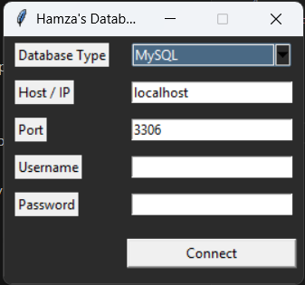
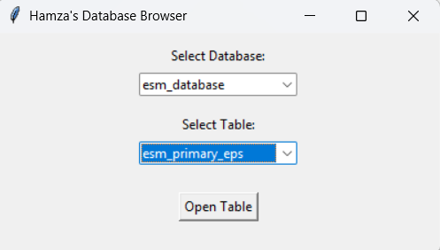
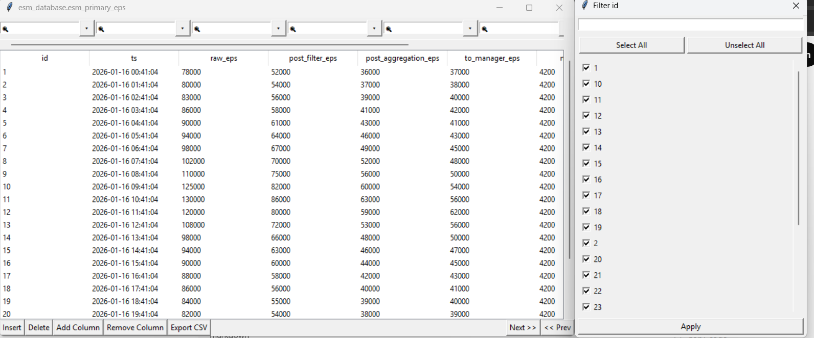

# Tkinter-DB-Browser

A **rich GUI database browser** built with Tkinter for **MySQL, PostgreSQL, and MSSQL**.  
It offers Excel-like table viewing with inline editing, column filtering, pagination, CSV export, and a dynamic responsive GUI.

## Features

- Connect to **MySQL, PostgreSQL, or MSSQL** databases
- Select databases and tables dynamically
- Excel-like **column filters** with:
  - Search
  - Select All / Unselect All
  - Scrollable checkbox list
- Inline **update, insert, delete** rows
- Add/remove columns dynamically
- **CSV export** of tables
- **Pagination** for large tables
- Dark/Light theme support
- Responsive UI

## Installation

1. Clone the repo:
<pre> 
git clone https://github.com/ihamzazahid/Tkinter-DB-Browser.git
cd Tkinter-DB-Browser
</pre>
2. Create virtual environment (optional but recommended):
<pre>
python -m venv env
env\Scripts\activate  # Windows
source env/bin/activate  # Linux/macOS
</pre>
3. Install Dependancies:
<pre>
pip install -r requirements.txt
</pre>

## Usage
Run the main script:
<pre>
python main.py
</pre>
1. Enter your database credentials.
2. Select database and tables.
3. Use Excel-style filters, edit rows, or export to CSV.

## Project Structure
<pre>
Tkinter-DB-Browser/
│
├─ main.py
├─ db/
├─ operations/
├─ ui/
└─ utils/
</pre>

## Screenshots

### Login Window

### Main Window

### Table View with Filters

## 🤝 Contributing
Open issues or submit PRs to improve the project.
## 📝 License
MIT License
